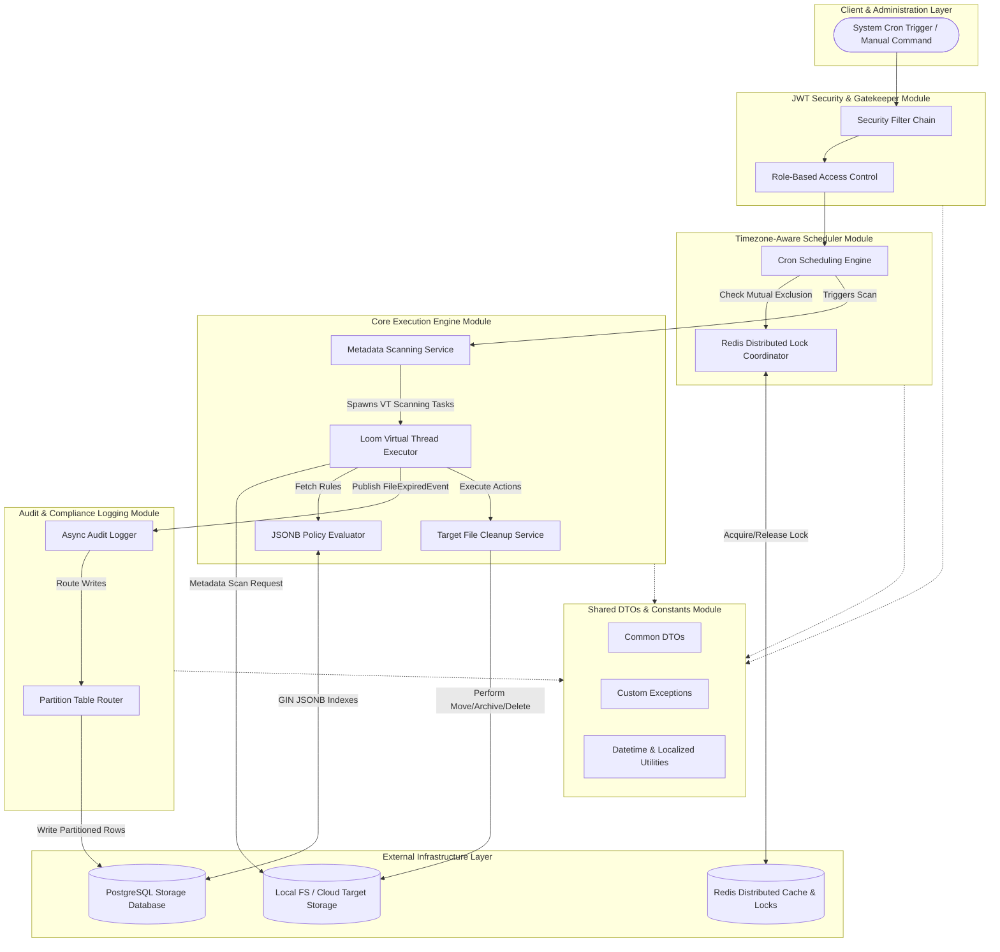

# AutoArchive: Enterprise Storage Lifecycle Management Platform

An automated storage lifecycle management platform that scans metadata, applies retention policies, archives inactive files, deletes expired files, and maintains audit logs for compliance tracking. Built as a **Modular Monolith** using **Java 21**, **Spring Boot**, **PostgreSQL**, and **Redis**.

---

## User Review Required

> [!IMPORTANT]
> **JPMS Boundaries & Strict Encapsulation**
> We are using the Java Platform Module System (JPMS). All services and modules must define strict public API boundaries in their `module-info.java` files. No circular dependencies will be allowed.

> [!WARNING]
> **PostgreSQL Audit Log Partitioning**
> The `audit_logs` table will be range-partitioned monthly based on the `created_at` timestamp. This requires an automated job or migration script to provision future partitions (e.g., `audit_logs_y2026m06`).

---

## Decisions

> [!NOTE]
> **Storage (v1): Local filesystem only**
> The first release targets **local filesystem** paths only (scan, archive move, delete via `java.nio.file`). Cloud providers (AWS S3, Azure Blob, etc.) are **out of scope for v1** but the core engine will use a `StorageService` interface so a cloud implementation can be added later without rewriting policy or audit logic.

| v1 (now) | Later (optional) |
| :--- | :--- |
| `LocalFileStorageService` — walk directories, read metadata, move/delete on disk | `S3StorageService`, `AzureBlobStorageService`, etc. |
| `file_path` = absolute local path (e.g. `C:\data\logs\app.log`) | `file_path` = object URI when cloud is added |
| Docker volumes or host bind mounts for dev/test targets | Cloud credentials and SDK dependencies |

---

## Proposed Changes

We will introduce the core layout, build structure, and configuration files for the modular monolith backend. No frontend or controller code will be introduced at this stage.

### Infrastructure & Orchestration

#### [NEW] [docker-compose.yml](file:///c:/Users/swala/Desktop/AutoArchiveSystem/docker-compose.yml)
Contains the PostgreSQL 15 and Redis 7 definitions needed for local development and integration testing.

---

### Project Configuration & Readme

#### [NEW] [README.md](file:///c:/Users/swala/Desktop/AutoArchiveSystem/README.md)
The root documentation detailing architecture, DB design, workflows, and running guides.

---

## 🗺️ Complete Project Architecture Diagram

Below is the detailed project architecture diagram showing interactions between JPMS modules, client interfaces, middleware engines, and local/external storage targets.



---

## ⚡ Concurrency & Platform Flow Diagrams

### 1. Java 21 Virtual Threads High-Throughput Scanning Flow
This flow details how Virtual Threads bypass OS platform thread limits during intensive directory or cloud metadata scans. Blocking I/O operations temporarily yield carrier threads to execute other virtual scanning threads seamlessly.

```mermaid
graph TD
    subgraph Java 21 Runtime (Loom Engine)
        subgraph Virtual Thread Queue
            VT1[Virtual Thread 1: Scan /data/logs]
            VT2[Virtual Thread 2: Scan /data/temp]
            VT3[Virtual Thread 3: Scan /data/archives]
            VTN[Virtual Thread N: Scan /data/backups]
        end

        subgraph Carrier Threads (ForkJoinPool)
            CT1((Carrier Thread A))
            CT2((Carrier Thread B))
        end
    end

    subgraph OS & Target Systems
        OS_Thread1[OS Thread 1]
        OS_Thread2[OS Thread 2]
        I_O_Bound[(I/O Network: S3/Disk Metadata)]
    end

    %% Mapping Virtual Threads to Carrier Threads
    VT1 -->|1. Mounts & Runs| CT1
    VT2 -->|2. Mounts & Runs| CT2
    
    %% Unmounting on Block
    CT1 -->|3. Hits I/O Blocking Scan| I_O_Bound
    VT1 -.->|4. Unmounts & Parks| Queue[Thread Parked until metadata returns]
    CT1 -->|5. Instantly Mounts Next| VT3
    
    %% Mapping Carrier Threads to OS
    CT1 --- OS_Thread1
    CT2 --- OS_Thread2
```

---

### 2. Redis Usage Flow (Locking, Rate-Limiting, & Cache)
Shows how Redis acts as the central coordinator in a distributed ecosystem: providing mutex locks for cron executions, protecting scanning endpoints from overload, and serving fast policy configs.

```mermaid
flowchart TD
    subgraph Application Nodes (Monolith Clustered Deployment)
        Node1[Monolith Container 1]
        Node2[Monolith Container 2]
    end

    subgraph Redis Core Service [Redis Cache & Coordinator]
        RLock{{"Distributed Locks<br>(key: lock:cleanup_job_id)"}}
        RLimit{{"Rate Limiter Keys<br>(key: ratelimit:client_ip)"}}
        RCache{{"Policy Cache<br>(key: policy:region:id)"}}
    end

    subgraph Database & Execution
        PG[(PostgreSQL Database)]
        Exec[Run Scan / Deletion Engine]
    end

    %% Flows
    Node1 -->|1. Try Acquire Lock| RLock
    Node2 -->|2. Try Acquire Lock| RLock
    RLock -->|Granted to Node 1| Exec
    RLock -->|Rejected/Hold| Node2
    
    Node1 & Node2 -->|3. Query active policies| RCache
    RCache -- Cache Miss --> PG
    RCache -- Cache Hit --> Exec
    
    Node1 -->|4. Rate Limit check| RLimit
    RLimit -->|Limit Exceeded| Abort[Reject Request / 429 Too Many Requests]
```

---

## 🗄️ Database Design (Entity Tables)

### Table: `retention_policies`
| Column | Data Type | Constraints & Indexes | Description |
| :--- | :--- | :--- | :--- |
| `id` | `UUID` | `PRIMARY KEY`, Default: `uuid_generate_v4()` | Unique policy identifier. |
| `name` | `VARCHAR(150)` | `NOT NULL` | Name of the retention rule set. |
| `description` | `TEXT` | `NULL` | Detailed description of the policy's purpose. |
| `rules` | `JSONB` | `NOT NULL`, `GIN (rules)` index | Flexible JSON structure containing rules like age limits, file extensions, and target action. |
| `region` | `VARCHAR(50)` | `NOT NULL`, B-tree index | AWS region code or geographic boundary (e.g., `US-EAST-1`). |
| `is_active` | `BOOLEAN` | `NOT NULL`, Default: `TRUE`, Partial Index with `region` | Flag indicating if this policy is actively evaluated. |
| `created_at` | `TIMESTAMPTZ` | `NOT NULL`, Default: `CURRENT_TIMESTAMP` | Policy creation timestamp. |
| `updated_at` | `TIMESTAMPTZ` | `NOT NULL`, Default: `CURRENT_TIMESTAMP` | Timestamp of the last update. |

### Table: `cleanup_jobs`
| Column | Data Type | Constraints & Indexes | Description |
| :--- | :--- | :--- | :--- |
| `id` | `UUID` | `PRIMARY KEY`, Default: `uuid_generate_v4()` | Unique job identifier. |
| `policy_id` | `UUID` | `FOREIGN KEY` references `retention_policies(id)` | Link to the target retention policy. |
| `job_name` | `VARCHAR(150)` | `NOT NULL` | Unique logical name of the scheduled task. |
| `cron_expression`| `VARCHAR(100)` | `NOT NULL` | The cron-like scheduling expression. |
| `timezone` | `VARCHAR(100)` | `NOT NULL`, Default: `'UTC'` | Timezone name (e.g., `America/New_York`) to compute runtimes. |
| `last_run_at` | `TIMESTAMPTZ` | `NULL` | Timestamp of the last execution trigger. |
| `next_run_at` | `TIMESTAMPTZ` | `NULL`, B-tree index (when `status = 'IDLE'`) | Computed next execution timestamp. |
| `status` | `VARCHAR(50)` | `NOT NULL`, Default: `'IDLE'` | Execution status: `IDLE`, `RUNNING`, `FAILED`, `PAUSED`. |
| `created_at` | `TIMESTAMPTZ` | `NOT NULL`, Default: `CURRENT_TIMESTAMP` | Job creation timestamp. |
| `updated_at` | `TIMESTAMPTZ` | `NOT NULL`, Default: `CURRENT_TIMESTAMP` | Timestamp of the last update. |

### Table: `storage_nodes`
| Column | Data Type | Constraints & Indexes | Description |
| :--- | :--- | :--- | :--- |
| `id` | `UUID` | `PRIMARY KEY`, Default: `uuid_generate_v4()` | Unique storage node identifier. |
| `file_path` | `VARCHAR(2048)`| `NOT NULL`, `UNIQUE` index | Absolute filesystem path or cloud object key URI. |
| `file_name` | `VARCHAR(255)` | `NOT NULL` | Base filename. |
| `file_size_bytes`| `BIGINT` | `NOT NULL` | File size in bytes. |
| `mime_type` | `VARCHAR(100)` | `NULL` | Content MIME type. |
| `created_time` | `TIMESTAMPTZ` | `NOT NULL` | Original file creation timestamp. |
| `last_modified_time`| `TIMESTAMPTZ`| `NOT NULL`, Composite index on `(region, status, last_modified_time)` | Last write/modify timestamp of the target. |
| `last_accessed_time`| `TIMESTAMPTZ`| `NOT NULL` | Last read/access timestamp of the target. |
| `metadata_tags` | `JSONB` | `NULL`, `GIN` index | Additional vendor, customer, or application metadata tags. |
| `region` | `VARCHAR(50)` | `NOT NULL` | Target geographic zone or container name. |
| `status` | `VARCHAR(50)` | `NOT NULL`, Default: `'ACTIVE'` | Life state: `ACTIVE`, `ARCHIVED`, `DELETED`. |
| `created_at` | `TIMESTAMPTZ` | `NOT NULL`, Default: `CURRENT_TIMESTAMP` | Tracking row registration timestamp. |
| `updated_at` | `TIMESTAMPTZ` | `NOT NULL`, Default: `CURRENT_TIMESTAMP` | Timestamp of last metadata update. |

### Table: `audit_logs` (Partitioned by Range on `created_at`)
| Column | Data Type | Constraints & Indexes | Description |
| :--- | :--- | :--- | :--- |
| `id` | `UUID` | `NOT NULL`, Default: `uuid_generate_v4()` | Unique log identifier (composite primary key with `created_at`). |
| `storage_node_id`| `UUID` | `NOT NULL` | ID of target storage node. |
| `file_path` | `VARCHAR(2048)`| `NOT NULL` | Path of the file at time of execution. |
| `action_type` | `VARCHAR(50)` | `NOT NULL` | Operational action executed: `SCAN`, `ARCHIVE`, `DELETE`. |
| `status` | `VARCHAR(50)` | `NOT NULL` | State of task execution: `PENDING`, `SUCCESS`, `FAILED`. |
| `bytes_freed` | `BIGINT` | `NULL`, Default: `0` | Bytes reclaimed by deletion or transfer size. |
| `error_message` | `TEXT` | `NULL` | Failure details or stack track error messages. |
| `policy_id` | `UUID` | `NULL` | Link to policy that triggered this action. |
| `cleanup_job_id` | `UUID` | `NULL` | Link to cleanup scheduler trigger context. |
| `created_at` | `TIMESTAMPTZ` | `NOT NULL`, Default: `CURRENT_TIMESTAMP`, **Partition Key** | Timestamp of log event creation. |

---

## Verification Plan

### Automated Tests
- **Policy Engine Tests**: Run JVM unit tests matching metadata patterns (size, type, age) against Mock dynamic JSONB rules.
- **Concurrency & Locking Tests**: Integration tests executing simultaneous scans to verify Redis distributed lock lock-out and graceful exit behaviors.
- **Partitioning Verification**: Inserting synthetic audit logs to verify PostgreSQL writes route correctly to the monthly partition table.

### Manual Verification
- Deploy containers using `docker-compose up -d`.
- Verify database tables, indexes, and initial partitions using `psql`.
- Confirm Redis capability by running `redis-cli ping` inside the caching container.
