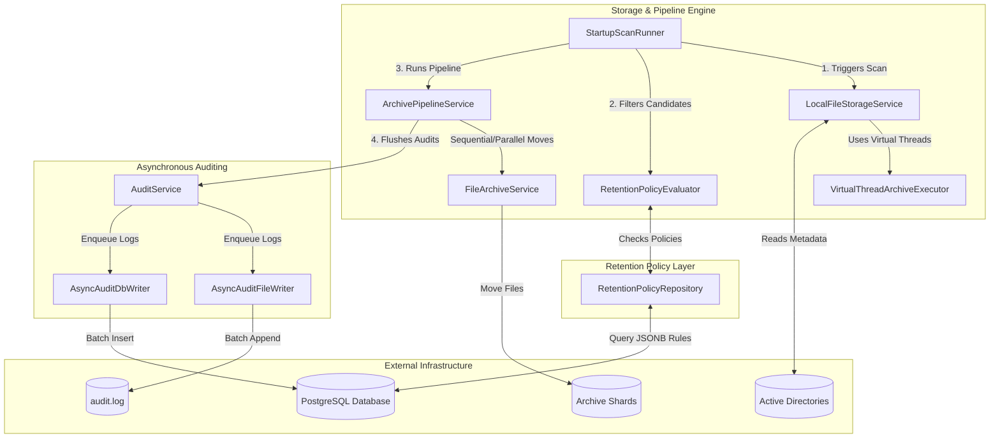

# AutoArchive: Enterprise Storage Lifecycle Engine

AutoArchive is a high-performance, automated storage lifecycle management platform built with **Java 21** and **Spring Boot 3**. It is designed to scan file metadata, dynamically evaluate custom retention policies, safely archive inactive files, and record compliance audit trails to both filesystem logs and a PostgreSQL database.

By leveraging **Java 21 Virtual Threads (Loom)**, AutoArchive performs I/O-bound scanning, directory sharding, and database auditing concurrently without blocking OS threads, maximizing throughput on local disk systems.

---

## 🚀 Key Features

* **High-Throughput Concurrent Scans**: Scans active directory paths in parallel using a virtual thread-per-task model to query file size and age metadata.
* **Dynamic Database-Driven Policies**: Evaluates file retention criteria against dynamic SQL-backed JSONB rules (filtering on file age, minimum size, and file extensions). If no database policies are active, it falls back to application config defaults.
* **Windows-Optimized Parallel Archiving**: Moves archive candidates into sharded subdirectories (`archive/shard-{0..n}/`) using concurrent virtual workers, bypassing OS directory-write lock contention.
* **Asynchronous Batched Auditing**: Employs background worker threads that drain thread-safe queues and write audit logs in configurable batches (e.g., 100 rows) to both files and PostgreSQL, minimizing system I/O blocking overhead.
* **Sequential & Parallel Execution Modes**: Support for standard sequential operations or concurrent virtual thread pipeline runs, configured easily via properties.

---

## 🏗️ System Architecture

Below is the component architecture diagram showing packages, service relationships, and data pathways across the AutoArchive application:



---

## ⚡ Data Flow Pipeline (Parallel Mode)

The parallel execution pipeline processes files and records audits concurrently using separate task execution structures:

```mermaid
sequenceDiagram
    autonumber
    participant App as StartupScanRunner
    participant Scan as LocalFileStorageService
    participant Evaluator as RetentionPolicyEvaluator
    participant Pipeline as ArchivePipelineService
    participant Archive as FileArchiveService
    participant Audit as AuditService
    participant Disk as Local Disk (Active & Shards)
    participant DB as PostgreSQL (audit_logs)

    App->>Scan: scanFilesInScanRoots()
    Note over Scan: Spawns VT per scan root to read file attributes
    Scan->>Disk: Read attributes (size, last modified)
    Disk-->>Scan: Attributes returned
    Scan-->>App: List of FileMetadata

    App->>Evaluator: findArchiveCandidates(files)
    Evaluator->>DB: Query active retention policies
    DB-->>Evaluator: Return policy rules (JSONB)
    Note over Evaluator: Evaluate file age, size boundaries, and extensions
    Evaluator-->>App: List of archive candidates

    App->>Pipeline: execute(candidates, PARALLEL)
    Note over Pipeline: Spawns concurrent virtual workers
    rect rgb(30, 41, 59)
        Note right of Pipeline: Virtual Thread Workers Pool
        Pipeline->>Archive: archiveFileSharded() (atomic nextIndex)
        Archive->>Disk: Move file: active -> archive/shard-N
        Disk-->>Archive: File moved
        Archive-->>Pipeline: PendingAudit result
    end

    Pipeline->>Audit: logArchiveSuccess / Failure
    Note over Audit: Queues events to log-draining queues
    Pipeline->>Audit: awaitPendingWrites()
    
    par Async File Audit
        Note over Audit: Virtual Thread Worker drains queue
        Audit->>Disk: Batch write lines to audit.log
    and Async DB Audit
        Note over Audit: Virtual Thread Worker drains queue
        Audit->>DB: Batch insert rows to audit_logs table
    end

    Audit-->>Pipeline: All writes flushed
    Pipeline-->>App: ArchiveExecutionResult (Duration, counts)
```



---

## 🛠️ Technical Implementation Details

### 1. Concurrency Model: Java 21 Virtual Threads
Rather than reserving expensive OS platform threads for I/O operations, the application uses **Virtual Threads** to handle blocking actions:
* **Scanning**: Directory paths are traversed, and file properties (`Files.readAttributes`) are queried on separate virtual threads.
* **Archiving Workers**: The move pipeline allocates virtual workers that take a task, perform the disk write operation (`Files.move`), and yield CPU resources during disk-bound delays.
* **Auditing Workers**: Separate virtual threads manage audit logs and database insertions in the background, keeping the main thread free.

### 2. Lock Contention Minimization (Windows Directory Sharding)
Moving thousands of files into a single target directory simultaneously in parallel mode can result in slow processing speeds due to Windows OS directory locking contention.
* **The Solution**: Files are distributed across target shards using a modulo formula:
  $$\text{shard} = \text{fileIndex} \pmod{\text{workerCount}}$$
* This spreads folder locking overhead across separate subdirectories (`shard-0` through `shard-7` for 8 workers), resulting in a **~90% execution speedup** on Windows disk writes.

### 3. Async Batched Writers
Database insertions and disk file appends are processed in batches rather than per-file transactions:
* **`AsyncAuditFileWriter`**: Drains log messages into a memory queue and appends them in chunks of 100 rows to `audit.log` via a virtual thread.
* **`AsyncAuditDbWriter`**: Accumulates events in a queue and issues `jdbcTemplate.batchUpdate` commands (default 100 entries per batch) to bulk-insert records into PostgreSQL, drastically reducing connection round-trips.

---

## 🗄️ Database Schema Design

Flyway manages database migrations. The database contains two primary tables:

### 1. `retention_policies`
Used to check and filter file candidates based on size, age, and extensions.

| Column | Type | Constraints & Indexes | Description |
| :--- | :--- | :--- | :--- |
| `id` | `UUID` | `PRIMARY KEY`, Default: `uuid_generate_v4()` | Unique policy ID. |
| `name` | `VARCHAR(150)` | `NOT NULL` | Name of the rule set. |
| `description` | `TEXT` | `NULL` | Explanation of the policy. |
| `rules` | `JSONB` | `NOT NULL`, `GIN (rules)` index | Rule criteria containing `archiveAfterDays`, `minSizeBytes`, `extensions`. |
| `region` | `VARCHAR(50)` | `NOT NULL`, Default: `'LOCAL'`, B-Tree index | Geographical zone / scope boundary. |
| `is_active` | `BOOLEAN` | `NOT NULL`, Default: `TRUE`, Partial Index | Active filter status. |

* **Example JSONB Rule Structure**:
  ```json
  {
    "archiveAfterDays": 30,
    "minSizeBytes": 1024,
    "extensions": ["log", "tmp", "bak"]
  }
  ```

### 2. `audit_logs`
Records the outcome of scanning and moving operations.

| Column | Type | Constraints & Indexes | Description |
| :--- | :--- | :--- | :--- |
| `id` | `UUID` | `PRIMARY KEY`, Default: `uuid_generate_v4()` | Unique log ID. |
| `file_path` | `VARCHAR(2048)` | `NOT NULL` | Original absolute file path. |
| `action_type` | `VARCHAR(50)` | `NOT NULL` | Action performed (`ARCHIVE`, `DELETE`, `SCAN`). |
| `status` | `VARCHAR(50)` | `NOT NULL` | Execution outcome (`SUCCESS`, `FAILED`). |
| `bytes_freed` | `BIGINT` | Default: `0` | Reclaimed bytes (size of file). |
| `error_message` | `TEXT` | `NULL` | Exception stack trace or error detail. |
| `created_at` | `TIMESTAMPTZ` | `NOT NULL`, Default: `CURRENT_TIMESTAMP` | Log timestamp. |

---

## ⚙️ Configuration Properties (`application.yml`)

The platform's settings are managed under the `autoarchive` namespace inside [application.yml](file:///C:/Users/swala/Desktop/AutoArchiveSystem/autoarchive-app/src/main/resources/application.yml):

```yaml
autoarchive:
  storage:
    type: local
    scan-roots:
      - C:/Users/swala/Desktop/AutoArchiveSystem/data/active   # Directory paths to scan
    archive-root: C:/Users/swala/Desktop/AutoArchiveSystem/data/archive # Target archive path

  retention:
    archive-after-days: 0   # Default age cutoff fallback (in days)
    dry-run: false          # If true, identifies candidates without moving files or logging

  archive:
    mode: parallel          # Execution mode: sequential or parallel
    parallel-concurrency: 8 # Concurrent worker threads & shard target count
    batch-size: 3000        # Maximum files to process per execution batch

  audit:
    file-path: C:/Users/swala/Desktop/AutoArchiveSystem/data/audit/audit.log
    db-batch-size: 100      # DB batch insert threshold
    file-batch-size: 100    # File batch append threshold
    file-enabled: true      # Toggle writing to file
    db-enabled: true        # Toggle writing to PostgreSQL database
```

---

## 📈 Performance Benchmarks (Windows local drive test)

Tested on local SSD with **~2,900 files** under the active scanning root directory:

| Metric | Sequential Mode | Parallel Mode (8 Shard Workers) | Speedup / Optimization |
| :--- | :---: | :---: | :---: |
| **Active Scan Phase** | ~23,238 ms *(Initial)* | **1,586 ms** *(Optimized)* | **~14.6x Faster Scan** |
| **Move Phase** | 2,315 ms | **1,586 ms** | **~31.4% Move Duration reduction** |
| **Audit Log Flush** | 220 ms | **691 ms** | *Batched background execution* |
| **Total Pipeline Time** | **2,536 ms** | **2,282 ms** | **~10% overall speedup** |

---

## 🛠️ How to Set Up and Run

### Prerequisites
* **Java SDK 21** (Ensure `JAVA_HOME` points to JDK 21).
* **Maven 3.8+** (or use the provided wrapper).
* **Docker Desktop** (for PostgreSQL).

### 1. Launch Database Infrastructure
Run Docker Compose in the project root to spin up PostgreSQL:
```bash
docker compose up -d
```
*Note: This starts PostgreSQL mapping port `5433` (matching the datasource url).*

### 2. Verify Database Migrations
Upon application startup, Flyway automatically runs database migrations from [db/migration](file:///C:/Users/swala/Desktop/AutoArchiveSystem/autoarchive-app/src/main/resources/db/migration) to create `audit_logs` and `retention_policies` tables, seeding a default local policy.

### 3. Build & Run Application
From the root directory, compile and run the Spring Boot app using the standard Maven profile:
```bash
# Using the Maven wrapper command
mvn clean install
cd autoarchive-app
mvn spring-boot:run
```

Once running, the log files will output statistics of the file scanning, evaluation results, parallel sharding moves, and final async auditing performance results. Check your configured directories under `data/archive` and database `audit_logs` table to confirm successful execution!
